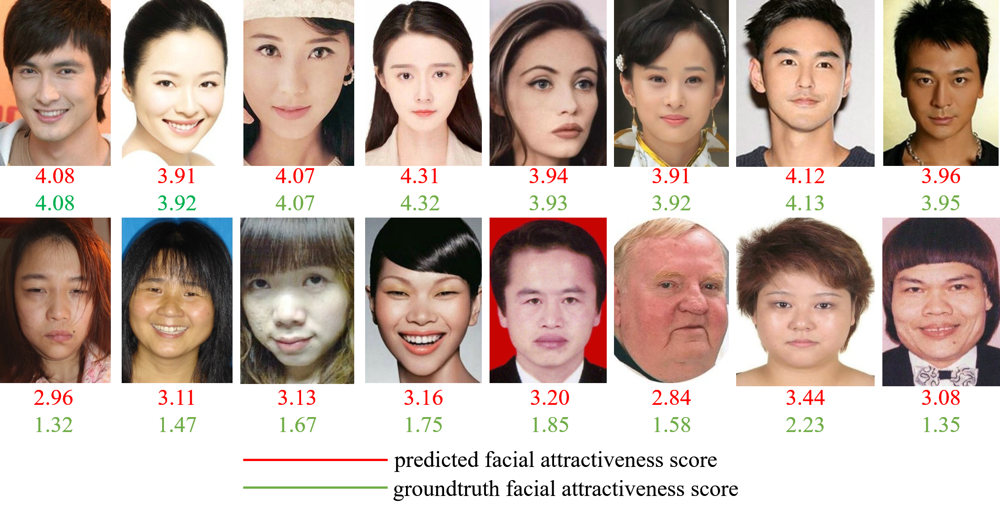
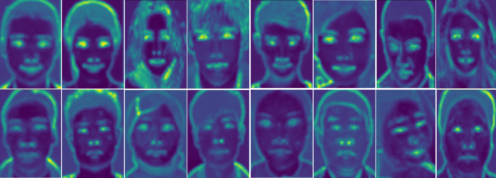

# Hierarchical Multi-task Networks for Race, Gender and Facial Attractiveness Recognition
## Introduction
This repository holds the PyTorch implementation of our paper ```Hierarchical
 Multi-task Networks for Race, Gender and Facial Attractiveness Recognition```.


## How to use
* Install 3rd party libraries   
    ````sudo pip3 install -r requirements.txt````
* Modify [cfg.py](./config/cfg.py) to fit your path


## Hyper-param Selection
| Loss | MAE | RMSE | PC | Acc_R | Acc_G| Epoch | WD |
| :---: | :---: | :---: | :---: | :---: | :---: | :---: | :---: |
| MSE | 0.2640 | 0.3465 | 0.8637 | 99.22% | 98.48% | 110 | 1e-2|
| MSE | 0.2556 | 0.3372 | 0.8693 | 99.68% | 98.53% | 170 | 5e-2|
| MSE | 0.2589 | 0.3382 | 0.8685 | 99.45% | 98.30% | 250 | 1e-1|
| L1 | 0.2500 | 0.3299 | 0.8753 | 99.26% | 98.16% | 150 | 5e-2|
| Smooth L1 | 0.2531 | 0.3313 | 0.8738 | 99.54% | 98.58% | 170 | 5e-2|


## Performance Comparison
| Methods | MAE | RMSE | PC |
| :---: | :---: | :---: | :---: |
| ResNeXt-50 | 0.2518 | 0.3325 | 0.8777 |
| ResNet-18 | 0.2818 | 0.3703 | 0.8513 |
| AlexNet | 0.2938 | 0.3819 | 0.8298 |
| CRNet | 0.2816 | 0.3669 | 0.8450 |
| **HMTNet (Ours)** | **0.2500** | **0.3299** | **0.8753** |


## Samples



## Visualization



## Citation
If you find this repository helps your research, please cite our paper:
```
@inproceedings{xu2019hierarchical,
  title={Hierarchical Multi-task Networks for Race, Gender and Facial Attractiveness Recognition},
  author={Xu, Lu and Heng, Fan and Jinhai, Xiang},
  booktitle={2019 26th IEEE International Conference on Image Processing 
  (ICIP)},
  year={2019},
  organization={IEEE}
}
```